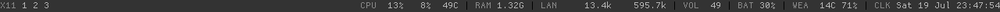

# Dotfiles

This is my personal configs repository.

I think you can understand which every config does. In case you have a
doubt, I explain about them in my blog at [van.do](http://van.do)

## Screenshots

### X11 display manager

I used xdm as display manager and cwm as window manager.

### Desktop

This is how looks like my desktop. I used maximized windows.

### Main window

As a main window I run an URxvt terminal with tmux inside.

### Tabbar

I use conky as a tabbar.

#### Default

At left side, *X11* lists windows based on CWM's windows groups

#### mbox detail

This monitoring local maildirs for unread emails.

### X11 Notifications

I use dunst because it looks like conky's part.

### Applications

#### Mutt

#### Irssi

#### RTorrent

#### CMus 

