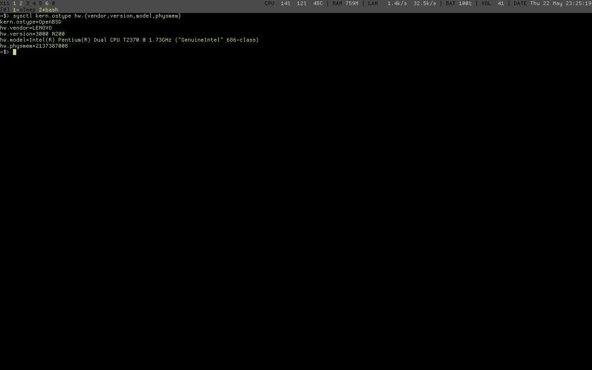
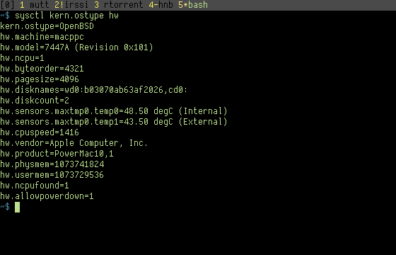
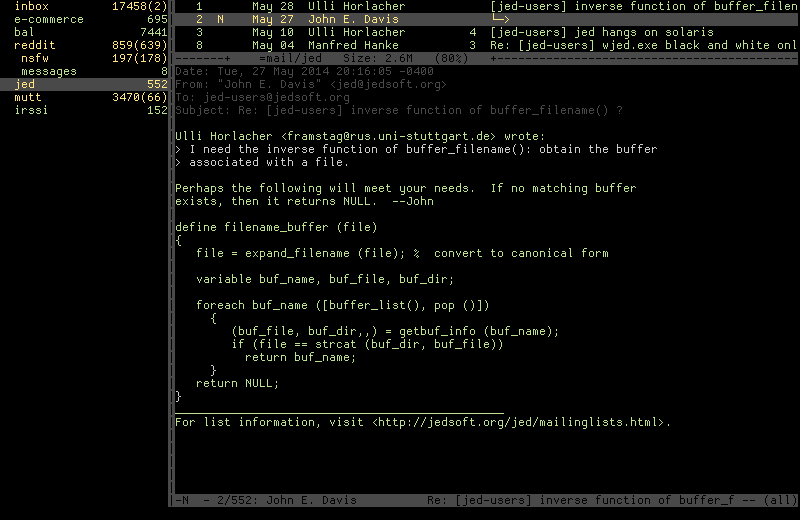
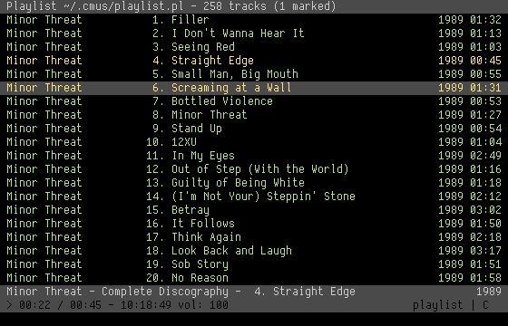

## X11 display manager

I used xdm as display manager and cwm as window manager.

## Desktop

This is how looks like my desktop. I used maximized windows.

## Main window

As a main window I run an URxvt terminal with tmux inside.

## Tabbar

I use conky as a tabbar.

### Default

At left side, *X11* lists windows based on CWM's windows groups

### mbox detail

This monitoring local maildirs for unread emails.

## X11 Notifications

I use dunst because it looks like conky's part.

## Applications

### Mutt

### Irssi

### RTorrent

### CMus 

